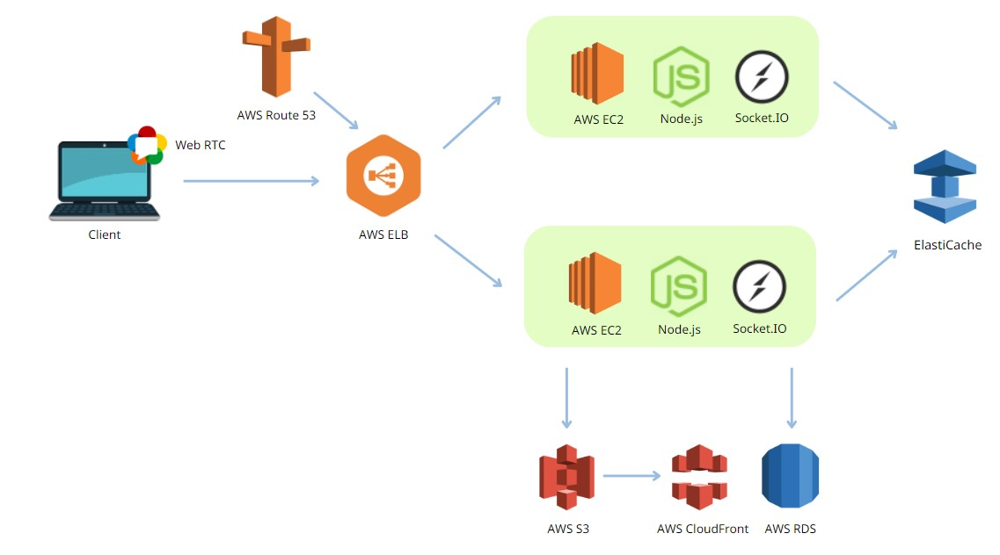
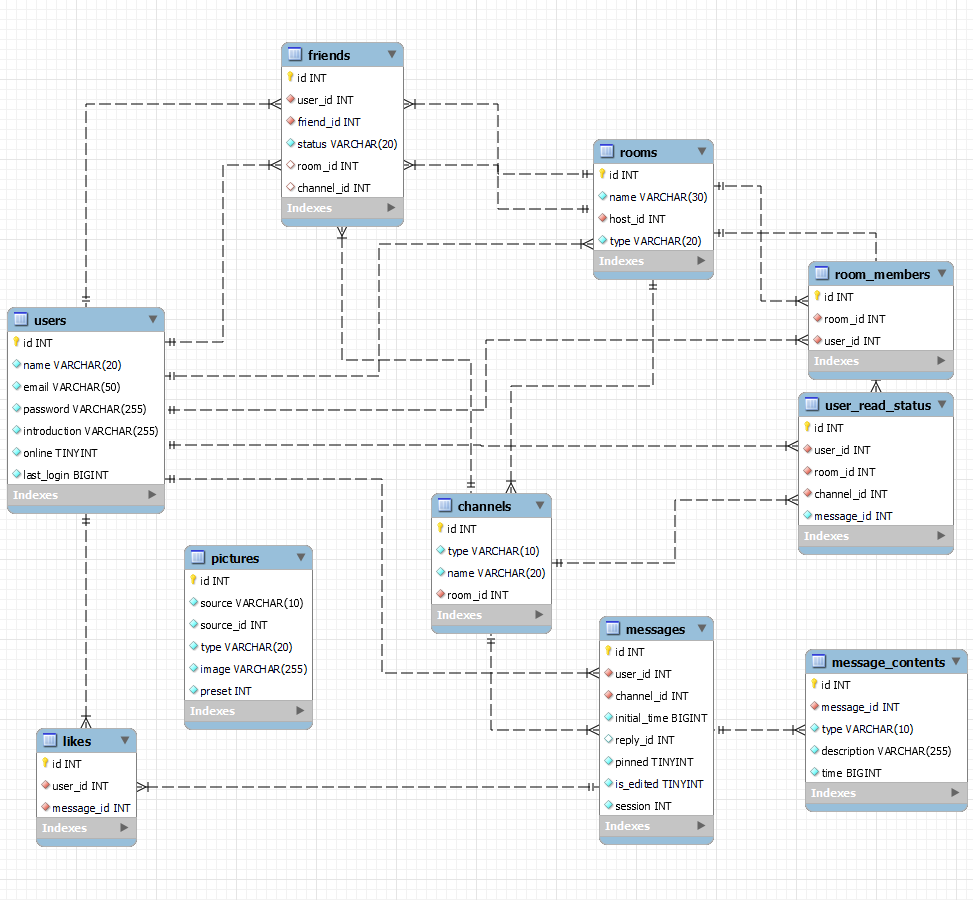

# ChillTalk

ChillTalk is a Web App for you to chill with friends real-time over messages and video.

## Test Account

User1

- Account: test123@test.com
- Password: test1234

User2

- Account: test124@test.com
- Password: test1234

## Tech Stack

- **Back-End:** Node.js, Express, Socket.IO, Nginx

- **Front-End:** HTML, CSS, JavaScript, WebRTC

- **Database:** MySQL (AWS RDS), Redis (AWS ElastiCache)

- **Cloud Service (AWS):** AWS ELB, AWS EC2, AWS S3, AWS CloudFront, AWS Route 53

## Architecture

## Database Schema

## Features

### Room / Channel Design

- Create / join rooms with customized titles and with different users.
- Allow users to choose between voice and text channels.
- Provide room members with online status and their personal info, mutual friends and rooms.
- Room hosts are able to update room picture and name.

### Text Channel

- Chat with your friend or other members in real time.
- Like, pin, edit, reply and delete messages.
- Jump to last read message whenever the user enters a channel.
- Group messages in the same block within a limited time frame.
- Users can check all unread messages in mailbox and all pinned messages.
- Search for messages in a room through user, channel name and pin status.

### Voice Channel

- Users are able to communicate in video stream.
- Choose the main stream source to display in the center of the screen from diffrent users.
- Turn on / off camera or microphone.

### Friend

- Allow the user to friend another user.
- Accept / reject friend request.
